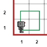
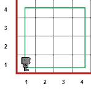
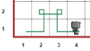
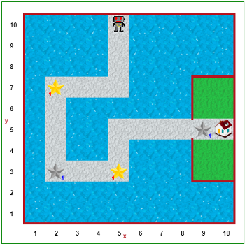
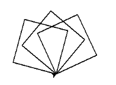
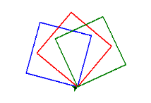

NAME:  

STUDENT ID:  

Remember to also initial in the upper right-hand header of each page.

**Due Wed. Sept. 16th by the end of class.**


# Portfolio 1: Programming Syntax and Semantics


 To succeed in these problems you will need to read and engage with the embedded activities in the following **Runestone texbook chapters** (worth 0.5 of a grade percentage point):

* Ch. 1: Introduction
* Ch. 2: Variables, Statements and Expressions

*For completing and self-correcting 70% of the below activities (during in-class share-outs), you will earn 1 grade percentage point*. For participating in a *share-out of 1 of the activities, you will earn 0.5 of a grade percentage point*.

Note that some activities we will plan to start in class and others you need to start on your own ("oyo"). You should finish each activity before its in-class share-out in order to correct it before final submission. Note the intended schedule below but keep in mind that the schedule is always subject to change.

Remember to print and attach your programs for the coding activities. Programs should be submitted to gradescope for autograder results, but credit is given to programs printed and included in this portfolio, on completetion, regaurdless of autograder results. Programs should be marked up for corrections during in-class share-outs.

## Table of Contents

This portfolio includes the following 10 activities and the report of your weekly share-out:

| Part   | Problem/Task                                | Page | In-class Start | In-class Share-out | Submission Format | 
|----|---------------------------------------------- |-----|-----------|----------------|-----------------------------|
| A1  | Written prompt: think?                         | 2    | W 9/9   | W  9/9       | Hand-written                |
| A2  | Written programs for human turtles             | 3    | W 9/9   | W  9/9       | Hand-written                |
| A3  | Written questions - computer basics            | 5    | Th 9/10 | Th 9/10      | Hand-written                |
| A4  | Prog. with Reeborg (patterns)                  | 7    | Th 9/10 | Th 9/10      | Printed                     |
| A5  | Prog. with Reeborg (newspaper)                 | 9    | Th 9/10 | F  9/11      | Gradescope & printed        |
| A6  |Questions - syntax, semantics, prompt           | 11   | F 9/11  | M  9/14      | Hand-written                |
| A7  | Tracing Re-assignment                          | 13   | oyo     | M  9/14      | Hand-written                |
| A8  | Prog. Arithmetic, reciept                      | 15   | M 9/14  | W  9/16      | Gradescope & printed        |
| A9  | Prog. Reeborg (winding sandbar)                | 17   | oyo     | W  9/16      | Gradescope & printed        |
| A10 | Prog. with Turtle (squares)                    | 19   | oyo     | W  9/16      | Gradescope & printed        |
| B1  | Share-out report                               | 21   | oyo     |              | Hand-written                |



# A1) Prompt: Can computers think? Why or why not? What does it mean, to "think"?




# A2) Programs for Human Turtles

1. Fold this sheet into thirds & turn it over.
2. On the back top third, draw something that could have been drawn by the Turtle robot.
3. On the front, in the top two thirds, write instructions (in English) for the robot to create this drawing.
4. Swap your instructions with someone who didn't see your drawing.
5. **Without looking at the drawing on the back** draw a picture following the instructions.
6. Fold down the top third and see - how closely does your drawing match the original?

\vspace{4em} 
……………………………………………………………………………………………………………………

instructions:

\vspace{8em} 

\vspace{4em} 


\vspace{8em} 

……………………………………………………………………………………………………………………
leave blank for drawing:



……

\vspace{8em} 


\vspace{4em} 


\rotatebox{180}{Draw something a turtle-bot could draw:}


……………………………………………………………………………………………………………………



# A3) Computers, Algorithms and Programs

* Take a look at **Runestone Chapters 1 & 2**  ... feel free to look at it while answering these questions and during today’s discussion


0. Name some parts of a computer.

    ………………………………………………………………………………………………

    ………………………………………………………………………………………………

    ………………………………………………………………………………………………

    ………………………………………………………………………………………………

2. Where are the programs you write stored when the computer is powered off? Why?

    ………………………………………………………………………………………………

    ………………………………………………………………………………………………

    ………………………………………………………………………………………………

    ………………………………………………………………………………………………

3. Where are the programs currently running on a computer stored? Why?

    ………………………………………………………………………………………………

    ………………………………………………………………………………………………

    ………………………………………………………………………………………………

    ………………………………………………………………………………………………

4. What is a reserved word in Python? Name a few.

    ………………………………………………………………………………………………

    ………………………………………………………………………………………………

    ………………………………………………………………………………………………

    ………………………………………………………………………………………………

5. How would you describe the difference between an interpreted programming language and a compiled programming language?

    ………………………………………………………………………………………………

    ………………………………………………………………………………………………

    ………………………………………………………………………………………………

    ………………………………………………………………………………………………

6. Describe some pros and cons of interpreted and compiled programming languages.

    ………………………………………………………………………………………………

    ………………………………………………………………………………………………

    ………………………………………………………………………………………………

    ………………………………………………………………………………………………

7. Can more than one algorithm be used to solve a problem? Why or why not?

    ………………………………………………………………………………………………

    ………………………………………………………………………………………………

    ………………………………………………………………………………………………

    ………………………………………………………………………………………………

8. Can an algorithm be written in more than one programming language? Why or why not?

    ………………………………………………………………………………………………

    ………………………………………………………………………………………………

    ………………………………………………………………………………………………

    ………………………………………………………………………………………………

9. What is a function? Why might functions be useful?

    ………………………………………………………………………………………………

    ………………………………………………………………………………………………

    ………………………………………………………………………………………………

    ………………………………………………………………………………………………

10. What is a parameter? 

    ………………………………………………………………………………………………

    ………………………………………………………………………………………………

    ………………………………………………………………………………………………

    ………………………………………………………………………………………………

10. What is an argument? 

    ………………………………………………………………………………………………

    ………………………………………………………………………………………………

    ………………………………………………………………………………………………

    ………………………………………………………………………………………………


# A4) Programs for Robots: Working with Reeborg

## Paired Programming Instructions

* Pair programming is a widely utilized programming method popular in industry and academia for the increase in quality it gives to both process (learning, comprehension, memory) and product (algorithm, program, results).

***

Paired programming guidelines:

* Roles: 
    +	driver: has the keyboard and types
    +	navigator: guides the driver

* Instructions:
    + You should be talking to each other constantly!
    +	You should be able to swap roles at any moment.
    +	Swap roles every 5 to 10 minutes.

***

{ width=600px }


* Note that most programming we do in class will be pair programming. The exceptions will be in-class practical exams where each student will work independently. 

* You will have the opportunity to practice indeipendent programming when finishing up assignments you don't finish in class, doing on assignments we don't start in class and doing your projects.


From the course website, under Resources, follow the link to Reeborg's World, or type out the url: <https://reeborg.ca/reeborg.html>

1. Write programs to make Reeborg walk the following patterns. Save each program in separate files.

::: {#reeborg-patterns layout-ncol=3}

{ width=100px }

{ width=200px }

{ width=200px }

Reeborg patterns
:::

2. In english (not code), what is your algorithm for each pattern?

    ………………………………………………………………………………………………

    ………………………………………………………………………………………………

    ………………………………………………………………………………………………

    ………………………………………………………………………………………………

    ………………………………………………………………………………………………

    ………………………………………………………………………………………………

    ………………………………………………………………………………………………

    ………………………………………………………………………………………………

    ………………………………………………………………………………………………

    ………………………………………………………………………………………………

    ………………………………………………………………………………………………


* To save, choose “Save program to file” from the “Program in editor” section of the “Additional options” menu.
* Note: Python programs are saved as text files, but the file names have the extension `.py`

3. Upload each file to your Google drive, or email to yourself, so you can print out these files to submit with your portfolio.

**For portfolio submission, insert you printed program pages here.**


# A5) Programs for Robots: Delivering a newspaper

{ width=500px }

1.	Select the `Newspaper 0` world. It should look like the image above. Find the "World Info" button, just to the right of the upper right hand corner of the above screenshot. What is the goal in this world?

    ………………………………………………………………………………………………

    ………………………………………………………………………………………………

    ………………………………………………………………………………………………

    ………………………………………………………………………………………………

2. In english (not code), what is your algorithm for your solution?

    ………………………………………………………………………………………………

    ………………………………………………………………………………………………

    ………………………………………………………………………………………………

    ………………………………………………………………………………………………

    ………………………………………………………………………………………………

    ………………………………………………………………………………………………
3. Write a program to implement your algorithm and solve `Newspaper 0`.
4.	Add comments to your program to explain what it’s doing (each step of your algorithm).
5.	Save the program in a file called `newspaper0.py` 
6.	Submit `newspaper0.py` on gradescope:
    a.	Follow link to gradescope (link can be found on the course website)
    b.	Select Union College from the list of options
    c.	Login using your Union College credentials
    d.	Find the assignment: `In-class Assignment: Newspaper 0`
    e.	Upload `newspaper0.py` to the assignment

7. Did the autograder produce error messages? How might you revise your algorithm and/or program?

    ………………………………………………………………………………………………

    ………………………………………………………………………………………………

    ………………………………………………………………………………………………

    ………………………………………………………………………………………………

    ………………………………………………………………………………………………

    ………………………………………………………………………………………………

    ………………………………………………………………………………………………

8. Were you able to solve this task? If not, can you think of anything else to try?

    ………………………………………………………………………………………………

    ………………………………………………………………………………………………

    ………………………………………………………………………………………………

    ………………………………………………………………………………………………

    ………………………………………………………………………………………………

    ………………………………………………………………………………………………

    ………………………………………………………………………………………………

    ………………………………………………………………………………………………

    ………………………………………………………………………………………………


9. Share the code you worked on with your partner(s) before you leave class. Upload it to your Google drive or email it so you can each complete it, if not already done, and print it out.

**For portfolio submission, insert you printed program pages here.**





# A6) Check-in Questions, Syntax and Semantics

Answer the following questions about Reeborg and Python (Turtle) syntax. Think about what the program syntax looks like and means. Programs can be valid, meaning they have proper syntax, but to be *correct* they must also do what the programmer intends them to do, meaning the semantics are right. 


**Take a look at Runestone Chapter 2 before completing the rest of this portfolio.**

1.	Which of the following programs are valid Reeborg programs that cause Reborg to execute a sequence of actions? What’s wrong with the invalid ones? (Assume Reeborg won't run into walls)

    a. ```
    Move() 
    Move()
    Move()
```

    b. ```
    move()
    turn_left()
    turn_left()
    turn_left()
    move()
```

    c. ```
    move()
    move()
    turn_right()
    move()
```

    d. ```
    move
    turn_left
    move
    move
```


2. The following is a function call statement:  
```turn_left()```
    a. What is the name of the function being called?

    ………………………………………………………………………………………………

    b. What purpose do the parentheses serve?

    ………………………………………………………………………………………………

    c. What is a function?

    ………………………………………………………………………………………………

    ………………………………………………………………………………………………

    d. What does “calling a function” mean?

    ………………………………………………………………………………………………

    ………………………………………………………………………………………………


3.	Consider the following Python program. Draw the pattern that the turtle draws when this program is executed. Also indicate the position and orientation of the turtle after this program has been executed.
Hint: The turtle starts out in the center of the turtle window, facing to the right


```
import turtle			

turtle.left(90)
turtle.forward(200)
turtle.left(180)
turtle.forward(100)
turtle.left(90)
turtle.forward(100)
```

\vspace{1em}

4.	Which of the following programs are valid Python programs? Indicate which are valid. For the invalid ones, explain or indicate what is wrong.
The import statement isn’t shown, but you can assume that the turtle module has been imported.

    a. ```
    turtle.forward(100)
    turtle.right(90)
    turtle.forward(100)
```

    b. ```
    turtle.forward
    turtle.left
    turtle.forward
```
    c. ```
    turtle.forward(100)
    turtle.turn_right(90)
    turtle.forward(100)
```
    d. ```
    turtle.Forward(100)
    turtle.right(90)
    turtle.Forward(100)
```


5. What required the most thinking --- coming up with algorithms, writing programs or communicating in pair programming? Did the activities rquire different *types* and/or *amounts* of thinking?

    ………………………………………………………………………………………………

    ………………………………………………………………………………………………

    ………………………………………………………………………………………………

    ………………………………………………………………………………………………

    ………………………………………………………………………………………………

    ………………………………………………………………………………………………

    ………………………………………………………………………………………………

    ………………………………………………………………………………………………

    


# A7) Tracing (re-)assignment with Memory Diagrams

Consider the following snippet of Python code.
```
1.	x = 5
2.	y = 10
3.	z = x
4.	x = y + 3
5.	y = z
```

\vspace{3em}

1.	Draw a memory diagram that shows the `<variable name>-<object/value>` associations after line 3 has been executed.

\vspace{10em}

2.	Draw a memory diagram that shows the `<variable name>-<object/value>` associations after line 4 has been executed.

\vspace{10em}


3.	Draw a memory diagram that shows the `<variable name>-<object/value>` associations after the whole snippet has been executed.

\vspace{10em}



4. In Python, what happens in the machine's memory blocks when a variable is assigned to another variable? Do the variables share a memory block, or is a new memory location used? Assume the inital variable was assigned to an integer value.

\vspace{10em}

 5. Depict the process you described above with a diagram/drawing.





# A8) Arithmetic in Python

Computer programming languages are often designed to handle arithmetic operations such as addition, subtraction, multiplication, division, and exponents. These operations are performed through the use of operators, several of which are listed below:

$$+, -, *, /, //, \%, **$$

Just as in mathematics, we can use these operators to develop complex mathematical equations. Also like in math in a more general sense, parentheses can be used to give some operations a higher priority than they would normally have. For example:

$$2 + 4 * 2 = 2 + 8 = 10$$
$$(2 + 4) * 2 = 6 * 2 = 12$$


1. Using IDLE, write a Python program that uses each of the operators shown above at least once. Please include comments explaining what it looks like each operator does. You may need to experiment with some of them to figure out exactly what they’re doing. Name your program `arithmetic.py`.

2. Add print statements to give the same information as the comments so a user will see an explanation of what the program is doing whenever they run it.

3.	Taxes, tips, and totals: Now we’re going to write a program to calculate the tax, tip, and total cost for dining at a restaurant. Name your program `receipt.py`.

	Start by assigning the following values to variables:
    i.	The meal’s subtotal of $35 (example name: `meal_cost`)
    ii.	The meal’s tax rate of 7% (example name: `tax_rate`)
    iii.	The meal’s tip rate of 25% (example name: `tip_rate`)

4.	Add code to compute the tax, tip, and total cost for the meal, then use print() to display a receipt that displays the following information:
```
RECEIPT
Sub-total: $35
Tax:       $2.45
Tip:       $8.75
Total:     $46.20
```
5. Make the numbers line up nicely. For the time being, it’s perfectly acceptable if $46.20 appears as $46.2 instead. 

6.	Change the values assigned to each of the three variables you created. Do the results produced by the altered program make sense? (e.g. is the tip computed correctly?) If not, then figure out why and try to fix it.

7.	Adjust the program so that `meal_cost`, `tax_rate`, and `tip_rate` are assigned from user input (i.e. using the `input()` function and type-casting).

8.	Test the new version of the program to make sure that the receipt information is correct based on the input.

9.	If you haven’t already done so, make sure to add comments explaining how the program works.

10.	Can you display the whole receipt using a single `print()` function call?

11. Did the autograder produce error messages? How might you revise your algorithm and/or program?

    ………………………………………………………………………………………………

    ………………………………………………………………………………………………

    ………………………………………………………………………………………………

    ………………………………………………………………………………………………

    ………………………………………………………………………………………………

    ………………………………………………………………………………………………

    ………………………………………………………………………………………………

12. Were you able to solve this task? If not, can you think of anything else to try?

    ………………………………………………………………………………………………

    ………………………………………………………………………………………………

    ………………………………………………………………………………………………

    ………………………………………………………………………………………………

    ………………………………………………………………………………………………

    ………………………………………………………………………………………………

    ………………………………………………………………………………………………

    ………………………………………………………………………………………………

    ………………………………………………………………………………………………

    ………………………………………………………………………………………………


**For portfolio submission, insert you printed program pages here.**



# A9) Programming practice: Reeborg

0. Do this part on the Reeborg's World website.

1.	Download the starter code from the course website. 
    * It is one file called: `winding_sandbar.json`

2.	Import the starter file winding_sandbar.json into Reeborg. 
    * To import a program, open the “Additional options” menu. 
    * Then look for the button “Open world from file.”
    * This should show you an environment that looks as follows:

{ width=350px }

3. What is the goal in this world?

    ………………………………………………………………………………………………

    ………………………………………………………………………………………………

    ………………………………………………………………………………………………

    ………………………………………………………………………………………………

    ………………………………………………………………………………………………

4. In english (not code), what is your algorithm for your solution?

    ………………………………………………………………………………………………

    ………………………………………………………………………………………………

    ………………………………………………………………………………………………

    ………………………………………………………………………………………………

    ………………………………………………………………………………………………

    ………………………………………………………………………………………………

    ………………………………………………………………………………………………

    ………………………………………………………………………………………………

    ………………………………………………………………………………………………

    ………………………………………………………………………………………………

5.	Complete the program so that Reeborg picks up the stars, deposits them in the indicated
spots and finishes at the house. Save your program file (not
the world file) in a file with the name `winding_sandbar.py`.
    * When pair-programming, as you go, add comments throughout indicating who was the “driver” and who was the “navigator” for each chunk. 
6.	Share the program between pairs using email or Google drive/
7.	Individually add comments to your code. Explain the different steps and including a header comment that names your partner. 
8. Submit your code on gradescope. Remember to also print it out to submit with your portfolio.

9. Did the autograder produce error messages? How might you revise your algorithm and/or program?

    ………………………………………………………………………………………………

    ………………………………………………………………………………………………

    ………………………………………………………………………………………………

    ………………………………………………………………………………………………

    ………………………………………………………………………………………………

10. Were you able to solve this task? If not, can you think of anything else to try?

    ………………………………………………………………………………………………

    ………………………………………………………………………………………………

    ………………………………………………………………………………………………

    ………………………………………………………………………………………………

    ………………………………………………………………………………………………


**For portfolio submission, insert you printed program pages here.**

# A10) Programming Practice: Turtle in Python


0. Your goal is to write a program that uses the turtle module to draw the following picture.

{ width=300px }

1. In english (not code), what is your algorithm for your solution?

    ………………………………………………………………………………………………

    ………………………………………………………………………………………………

    ………………………………………………………………………………………………

    ………………………………………………………………………………………………

    ………………………………………………………………………………………………

    ………………………………………………………………………………………………

2. Now, in IDLE, write your program in Python. Save your program in a file called squares.py

3.	Think about how you would modify your program so that it draws the same three squares, but each of them in a different color. 

{ width=300px }


 3. (cont.) In english (not code), what is your algorithm for your solution?

    ………………………………………………………………………………………………

    ………………………………………………………………………………………………

    ………………………………………………………………………………………………

    ………………………………………………………………………………………………

    ………………………………………………………………………………………………

4. Now edit your previous program to implement your new algorithm. Don’t forget to add comments to your code to help human readers. Save your program in a file called colored_squares.py. 

5. Submit your code on gradescope. Remember to also print it out to submit with your portfolio.
6. Did the autograder produce error messages? How might you revise your algorithm and/or program?

    ………………………………………………………………………………………………

    ………………………………………………………………………………………………

    ………………………………………………………………………………………………

    ………………………………………………………………………………………………

    ………………………………………………………………………………………………

    ………………………………………………………………………………………………

    ………………………………………………………………………………………………

7. Were you able to solve this task? If not, can you think of anything else to try?

    ………………………………………………………………………………………………

    ………………………………………………………………………………………………

    ………………………………………………………………………………………………

    ………………………………………………………………………………………………

    ………………………………………………………………………………………………

    ………………………………………………………………………………………………

    ………………………………………………………………………………………………

**For portfolio submission, insert you printed program pages here.**



# B1: Share-out

0. Did you share-out this week? If not, and if you would like to make up your credit, where in the upcoming schedule would you like to be added?

    ………………………………………………………………………………………………

    ………………………………………………………………………………………………

    ………………………………………………………………………………………………

    ………………………………………………………………………………………………

1. For which activity did you share-out?

    ………………………………………………………………………………………………

    ………………………………………………………………………………………………

    ………………………………………………………………………………………………

    ………………………………………………………………………………………………

2. What was the solution you shared?

    ………………………………………………………………………………………………

    ………………………………………………………………………………………………

    ………………………………………………………………………………………………

    ………………………………………………………………………………………………

    ………………………………………………………………………………………………

    ………………………………………………………………………………………………

    ………………………………………………………………………………………………

    ………………………………………………………………………………………………

    ………………………………………………………………………………………………

3. If any, what changes did you make to your solution in response to questions or discussion?

    ………………………………………………………………………………………………

    ………………………………………………………………………………………………

    ………………………………………………………………………………………………

    ………………………………………………………………………………………………

    ………………………………………………………………………………………………

    ………………………………………………………………………………………………

    ………………………………………………………………………………………………

    ………………………………………………………………………………………………

    ………………………………………………………………………………………………

    


# B2: Share-out 2 (optional, for make-ups)

0. Did you share-out this week? If not, and if you would like to make up your credit, where in the upcoming schedule would you like to be added?

    ………………………………………………………………………………………………

    ………………………………………………………………………………………………

    ………………………………………………………………………………………………

    ………………………………………………………………………………………………

1. For which activity did you share-out?

    ………………………………………………………………………………………………

    ………………………………………………………………………………………………

    ………………………………………………………………………………………………

    ………………………………………………………………………………………………

2. What was the solution you shared?

    ………………………………………………………………………………………………

    ………………………………………………………………………………………………

    ………………………………………………………………………………………………

    ………………………………………………………………………………………………

    ………………………………………………………………………………………………

    ………………………………………………………………………………………………

    ………………………………………………………………………………………………

    ………………………………………………………………………………………………

    ………………………………………………………………………………………………

3. If any, what changes did you make to your solution in response to questions or discussion?

    ………………………………………………………………………………………………

    ………………………………………………………………………………………………

    ………………………………………………………………………………………………

    ………………………………………………………………………………………………

    ………………………………………………………………………………………………

    ………………………………………………………………………………………………

    ………………………………………………………………………………………………

    ………………………………………………………………………………………………

    ………………………………………………………………………………………………

    


    