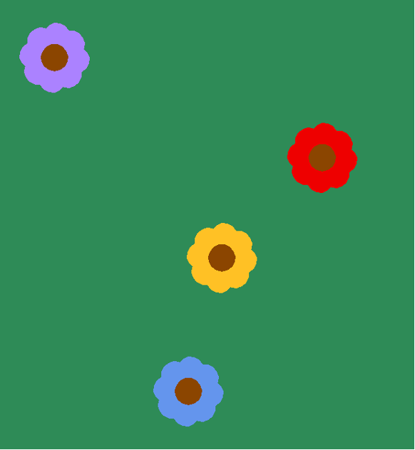

NAME:  

STUDENT ID:  

Remember to also initial in the upper right-hand header of each page.

**Due Wed. Sept. 23th at the end of class.**

# Portfolio 2: Variables and Functions


 To succeed in these problems you will need to read and engage with the embedded activities in the **Runestone texbook chapters** (worth 0.5 of a grade percentage point):

* 3: Debugging
* 4: Functions

*For completing and self-correcting 70% of the below activities, you will earn 1 grade percentage point*. Additionally, for participating in a *share-out of 1 of the activities, you will earn 0.5 of a grade percentage point*.

Note that some activities we will plan to start in class and others you need to start on your own. You should finish each activity before its in-class share-out in order to correct it before final submission.

Remember to print and attach your programs for the coding activities. Programs should be submitted to gradescope for autograder results, but credit is giving to programs printed and included in this portfolio, on completetion, reguardless of autograder results. Programs should be marked up by hand for corrections.

## Table of Contents

This portfolio includes the following 10 activities and the report of your weekly share-out:

| Part   | Problem/Task                                 | Page | In-class Start | In-class Share-out  | Submission Format          | 
|----|------------------------------------------------ |------|---------|--------------|-----------------------------|
| A1  | Written prompt                                 |     |     |       |          |
| A2  | Functioncs for Reeborg (stars, carrots)            |     |     |       |          |
| A3  | Prog. with Turtle (flowers)                    |     |     |       |          |
| A4  | Functions I/O (even, math quiz, return)         |     |     |       |          |
| A5  | Prog. with Turtle (house)                      |     |     |       |          |
| A6  | Prog. Python (ascii art)                       |     |     |       |          |
| A7  | Written study questions                        |     |     |       |          |
| A8  | Prog. Python (temp, bookstore)                 |     |     |       |          |
| A9  | Prog. Python (birthday)                    |     |     |       |          |
| A10 | Prog. Python (cricut)                        |     |     |       |          |
| B1  | Share-out report                               |     |     |       |          |



# A1) Prompt: Is randomly generating values creative? Does it produce novel information? Is it "just" following instructions? Why or why not??




# A2) Writing Functions for Reeborg

###  Writing programs with functions


Going forward, you should be looking for opportunities to define functions to make your code less repetitive and easier to read.

In general, a function should:

* handle one clearly defined logical sub-task (i.e. it shouldn’t be your whole program)
* have a name that describes (or at least hints at) the function’s purpose
* be accompanied by a comment that describes what the function does in more detail than what can be communicated solely through the function name
    + (very optional) While completely optional in this course, if you plan to go into software development, it may be useful to look at the page for Python’s Docstring Conventions (<https://peps.python.org/pep-0257/>) to see a common way functions are documented in professional settings. Strictly speaking docstrings are slightly different from traditional comments, but they will be counted as such when used to describe a function in this course.

### Reeborg Picking Up Stars

1.	Download the starter file `stars0.json` from the course website and import it into Reeborg’s World.
2.	Define a function `collect_row_of_stars` that helps Reeborg pick up all the stars. When you call this function, Reeborg should move across the world and collect all the stars lined up on the bottom row. Use loops as appropriate. You can also define other functions.
3.	Download the starter file `stars1.json` from the course website and import it into Reeborg’s World.
4.	Write a program that helps Reeborg pick up all the stars in the world. Can you reuse any function(s) that you defined to solve the previous world?
5.	Don’t forget to include comments in your code.
6. Give your program a meaningful name (ending in `.py`) and submit to Gradescope.

In english (not code), what is your algorithm for your solution?

    ………………………………………………………………………………………………

    ………………………………………………………………………………………………

    ………………………………………………………………………………………………

    ………………………………………………………………………………………………

    ………………………………………………………………………………………………

    ………………………………………………………………………………………………

    ………………………………………………………………………………………………

    ………………………………………………………………………………………………

    ………………………………………………………………………………………………

    ………………………………………………………………………………………………

### Reeborg Harvesting Carrots

1.	Open the tutorial world Harvest 1.
2.	Write a program that helps Reeborg harvest the field of carrots.
    + Before you start writing code, think about different approaches (i.e. walking paths) that Reeborg could use to keep things efficient.
    + Try to choose a path that allows you to make good use of function definitions and loops to create a program that’s easy to read.
3.	Don’t forget to include comments in your code.
4. Give your program a meaningful name (ending in `.py`) and submit to Gradescope.



# A3) Functions for Turtle

### Turtle: Flower Meadow

1.	Define a function called `flower` that uses the `turtle` module to draw a flower (any colors):

{ width=100px }

2.	Use the flower function to draw a flower meadow like in the picture below (use whatever colors you like, but try to use at least three different colors):

{ width=300px }

You can set the background color using the following function: `turtle.bgcolor(<specified color>)`

3.	Don’t forget to include comments in your code.
4.	(Optional) Modify your program so that the locations of the flowers are random.
5.	(Optional) Try to figure out which colors were used in the example pictures. All the colors used can be found on this web page: <http://cs111.wellesley.edu/archive/cs111_fall14/public_html/labs/lab12/tkintercolor.html>
6. Give your program a meaningful name (ending in `.py`) and submit to Gradescope.





# A4) Functions: Input/Output

### 1. Practicing functions with input: Is it even?

Define a function called `is_even` that determines whether a given integer is even. 

-	The user inputs a number
-	The program checks whether the number is even or odd and prints the result

Remember Python’s arithmetic operators:

$$+, -, *, /, //, \%, **$$

What does it mean for a number to be even? Which of the operators will help you test for evenness?


### 2. Math facts quiz

Write a function `math_quiz` that helps elementary students practice their math facts. 

-	Ask the user to input two numbers
-	Ask the user which number is greater
-	If the user’s answer is right, print : 

`“Correct!”`

-	If the user’s answer is wrong, print: 

`“Incorrect, the correct answer is <the correct value>!” `

-	(Optional) Add the functionality to randomly generate the two numbers instead of user input. Present the numbers to the user, and then wait for the user to input a result. 
-	(Optional) If the user’s result is correct, the function should print out a message indicating as much. Otherwise, it should say that the answer was incorrect and show the right answer.

**Remember to give your programs meaningful names (ending in `.py`) and submit to Gradescope.**

### User input and output vs. function input and output

* user input/output: to communicate with the *user* of a program.
    + **user input**: built-in function `input()`
    + **user output**: built-in function `print()`

* function input/output: for different parts of a program to communicate with each other.
e.g. between two functions, between the global namespace (scope) and a function’s namespace (scope)
    + **function input**: the function’s parameters
    + **function output**: the function’s return value

Functions that take parameters and return values are more versatile than ones that directly ask a user for input and respond accordingly. Functions that take parameters and return results can still be used in programs that ask for user input then call the function with the user input as parameter values.

In contrast to functions that take parameters and return values, functions that rely on direct user input are more limited in their applicability. Specifically, these functions can’t be used as building blocks for larger programs where the function needs to be able to handle values calculated by other parts of the program or where the function’s results need to be processed further.

Please be sure to read problem specifications carefully. Unless the instructions specify otherwise, generally, you should assume that any input values the function requires should be provided as parameters and that any results the function calculates should be returned.

1.	Improve the temperature conversion function from last time by re-writing it to take a temperature in degrees Fahrenheit as a parameter, then **return** the temperature in degrees Celsius.


### 4. Defining functions with return values

1. Circle area

Define a function called `circle_area` that calculates the area of a circle. Given the circle’s radius, the function should return the area.

The area of a circle is given by the following equation:

$$Area = \pi r^2$$

Python’s math module contains a variable called pi that gives you an approximation of $\pi$. Given what you know about modules, how can you use this predefined variable in your code?

Once you have imported the math module (`import math`), you can access $\pi$ with: `math.pi`

* Note the lack of parentheses. Pi, here, is a variable, not a function, so no parentheses are used.

2. Pizza cost per square inch

Define a function called `pizza_cost` that calculates then returns the cost per square inch for a circular pizza, given the pizza’s diameter and total price. You should use the `circle_area` function from the previous question to help calculate the expected value.

3. Coffee intake

Define a function that calculates how much coffee will fit into a cylindrical mug, given its radius and height. You should be able to reuse the `circle_area` function you’ve previously defined.

The volume of a cylinder is given by:

$$V_{cylinder} = A_{circle} * height$$

4. Random Sizes

Test your functions by using the `random` module to generate random sizes for the radius of a circle, cost of a pizza, and height of a mug.



# A5) Functions for Drawing: St. Nick's House

### 1. St. Nicholas’ house

1.	Download the starter code `house.py` from the course website. The file contains code to draw a house-like shape .
    + German kids know this shape as "St. Nicholas’ house". It can be used as a puzzle where you have to draw the shape without lifting your pencil and without tracing.

2.	Define a function called `house` that draws the shape.
3.	Define a function `fly_to` that does the same things as the `turtle.setpos` / `turtle.goto`, but doesn’t leave a line behind as the turtle moves.
4.	Use these functions to draw a few houses in different locations
5.	Modify the `house` function so that it allows you to draw houses of different sizes and colors.
Start by figuring out how many parameters your function needs and what each parameter represents.
6.	Draw a picture of houses in different colors and sizes. For example:

{ width=400px }

7.	Modify your program so that the size and location of the houses is random.




# A6) 

### 2. ASCII art

ASCII art uses keyboard characters to create pictures. For example:
```
Zzzzz  |\      _,,,---,,_
	 /,`.-’`’    -.  ;-;;,_
	|,4-  ) )-,_..;\ (  `’-’
     ‘---’’(_/--’  `-’\_)
```

1.	Define a function called ascii_tree that uses the print function to display the following picture:

```
   *
  ***
 *****
*******
  ***
```

2.	Now add two parameters to the function which specify which characters to use for the branches and the trunk. The function should now be able to print the following:

```
   o
  ooo
 ooooo
ooooooo
  nnn

   -
  ---
 -----
–------
  ###

   ~
  ~~~
 ~~~~~
~~~~~~~
  vvv

   i
  iii
 iiiii
iiiiiii
  uuu
```



# A7: Written Questions

### 1. 1.	Which of the following are valid first lines for a Python function definition? Please explain why the invalid ones are not valid.

a.	`def plus ten (anumber):`

\vspace{6em}

b.	`def double (anumber)`

\vspace{6em}

c.	`def greeting:`

\vspace{6em}

d.	`percentage(total, part):`

\vspace{6em}

e.	`def print_introduction():`

\vspace{6em}

f.	`def move()`

\vspace{6em}

g.	`def goto(x coordinate y coordinate):`

\vspace{6em}

### 2.	Consider the Python program below:

```
1)	def sum_to_n(n):
2)	     total = 0
3)	     for count in range(0, n+1):
4)	          total += count
5)	     return total
6)	 
7)	print(sum_to_n(6))
```


a. Draw a memory diagram that shows what memory looks like after the Python interpreter has executed line 2.

\vspace{7em}

b. Draw a memory diagram that shows what memory looks like after the Python interpreter has executed line 4 for the first time.

\vspace{7em}

c.	How many times will line 4 be executed in total?

\vspace{2em}

d.	Draw a memory diagram that shows what memory looks like right before the Python interpreter executes line 5.

\vspace{8em}

e.	Draw a memory diagram that shows what memory looks like right after the Python interpreter executes line 7.

\vspace{8em}


### 3.	Print or return? 

Consider the following (incomplete) function definitions. 

Given the way these functions are used in the code at the end, complete the dotted lines by either turning them into a statement that **returns** the indicated value or into a statement that **prints** the indicated value. 

Also complete the dotted lines in the code at the end by choosing to either `return` or `print` the value of the variable `a`.

```
def f1():
    a = int(input(‘Please input a number: ‘))

    ....................a........
```

```
def f2(var):
        squared = var**2

    ....................squared........
```

```
def f3(var):

    ....................var**3........
```


```
a = 10

....................a........
f2(a)
print(f1() + 3)
a = f3(a) * 5

....................a........
```

\vspace{2em}


f. Assuming that the user input 1 when asked for a number, what will this code print to the screen?

………………………………………………………………………………………………

………………………………………………………………………………………………

………………………………………………………………………………………………

………………………………………………………………………………………………

………………………………………………………………………………………………

………………………………………………………………………………………………




# A8:

###  Function parameters vs. user input

Consider the following two programs:

```
1)	# Temperature Conversion Version 1
2)	def fahrenheit_to_celsius(fahrenheit):
3)	     celsius = (fahrenheit - 32) * 5 / 9
4)	     print(fahrenheit, "deg Fahrenheit is", end=" ")
5)	     print(celsius, "deg Celsius.")
6)	
7)	temperature = int(input("What is the temperature in Fahrenheit? "))
8)	fahrenheit_to_celsius(temperature)
```

____________________________

```
1.	# Temperature Conversion Version 2
2.	def fahrenheit_to_celsius():
3.	     fahrenheit = int(input("What is the temperature in Fahrenheit? "))
4.	     celsius = (fahrenheit - 32) * 5 / 9
5.	     print(fahrenheit, "deg Fahrenheit is", end=" ")
6.	     print(celsius, "deg Celsius.")
7.	
8.	fahrenheit_to_celsius()
```

1.	From the user’s point of view, do these programs behave differently?
2.	From the programmer’s point of view, which one is better and why?
    + Save your answers as comments in a `.py` file, which you’ll use for the next problem.

## 4. Bookstore


Define a function called `book_order`, which should take the cover price of a book and the number of copies the store wants to order as its parameters. Suppose that bookstores get a 40% discount. Shipping costs $3 for the first copy and $0.75 for each additional copy. The function should print out a message indicating

●	the cover price of the bok
●	the number of copies ordered
●	what the bookstore will have to pay for the books (don’t forget the discount)
●	the shipping cost
●	the total amount the bookstore will have to pay (for books + shipping)

For example, if you called `book_order(12.97, 15)` (meaning the store orders 15 copies of a book that costs $12.97), it should print:

```
cover price: $12.97
copies ordered: 15
order cost: $116.73
shipping: $13.50
total: $130.23
```

Hint: you can use the built-in round function to `round(<value>, <decimal places>)` to a desired number of digits after (or before) the decimal point. You can find the documentation in the Python Library Reference section on Built-in Functions, which can also be found through the Resources section on the course website: <https://docs.python.org/3/library/functions.html>

Don’t forget to comment your code and organize it in a sensible way.

Don’t forget to include your answers from section 3 as comments in the code.

Save your program in a file like `bookstore.py`.



# A9: 

# Programming Part 1: Happy Birthday

1.	Download the starter file `birthday.py` from the course website and read the instructions inside before continuing.
2.	Write a function that “sings” Happy Birthday for someone. The function should take the person’s name as a parameter and then print Happy Birthday in the following format.:

```
Happy Birthday to you!
Happy Birthday to you!
Happy Birthday dear <name>!
Happy Birthday to you!
```

3.	Make sure to include appropriate comments.
4.	Save your program using the filename `birthday.py`.



# A10: 

# Programming Part 2: Cricket Chirping

1.	Download the starter file `cricket.py` from the course website and read the instructions inside before continuing.
2.	Amos Dolbaer discovered that, for certain types of crickets, there’s a relationship between the temperature and the rate at which they chirp (<https://en.wikipedia.org/wiki/Dolbear's_law>). More specifically, the relationship is as follows:

$$T = 50 + (N-40)/4$$

where $T$ is the temperature in Farenheight and $N$ the number of chirps per minute.

Write a function that calculates the temperature when given the number of times a cricket chirps in 15 seconds. Your function should do the following:

a. calculate the chirps per minute
b. calculate the temperature based on chirps per minute
c. return the temperature

3.	Save your program in a file called `cricket.py`




# B1: Share-out

0. Did you share-out this week? If not, and if you would like to make up your credit, where in the upcoming schedule would you like to be added?

    ………………………………………………………………………………………………

    ………………………………………………………………………………………………

    ………………………………………………………………………………………………

    ………………………………………………………………………………………………

1. For which activity did you share-out?

    ………………………………………………………………………………………………

    ………………………………………………………………………………………………

    ………………………………………………………………………………………………

    ………………………………………………………………………………………………

2. What was the solution you shared?

    ………………………………………………………………………………………………

    ………………………………………………………………………………………………

    ………………………………………………………………………………………………

    ………………………………………………………………………………………………

    ………………………………………………………………………………………………

    ………………………………………………………………………………………………

    ………………………………………………………………………………………………

    ………………………………………………………………………………………………

    ………………………………………………………………………………………………

3. If any, what changes did you make to your solution in response to questions or discussion?

    ………………………………………………………………………………………………

    ………………………………………………………………………………………………

    ………………………………………………………………………………………………

    ………………………………………………………………………………………………

    ………………………………………………………………………………………………

    ………………………………………………………………………………………………

    ………………………………………………………………………………………………

    ………………………………………………………………………………………………

    ………………………………………………………………………………………………

    


# B2: Share-out 2 (optional, for make-ups)

0. Did you share-out this week? If not, and if you would like to make up your credit, where in the upcoming schedule would you like to be added?

    ………………………………………………………………………………………………

    ………………………………………………………………………………………………

    ………………………………………………………………………………………………

    ………………………………………………………………………………………………

1. For which activity did you share-out?

    ………………………………………………………………………………………………

    ………………………………………………………………………………………………

    ………………………………………………………………………………………………

    ………………………………………………………………………………………………

2. What was the solution you shared?

    ………………………………………………………………………………………………

    ………………………………………………………………………………………………

    ………………………………………………………………………………………………

    ………………………………………………………………………………………………

    ………………………………………………………………………………………………

    ………………………………………………………………………………………………

    ………………………………………………………………………………………………

    ………………………………………………………………………………………………

    ………………………………………………………………………………………………

3. If any, what changes did you make to your solution in response to questions or discussion?

    ………………………………………………………………………………………………

    ………………………………………………………………………………………………

    ………………………………………………………………………………………………

    ………………………………………………………………………………………………

    ………………………………………………………………………………………………

    ………………………………………………………………………………………………

    ………………………………………………………………………………………………

    ………………………………………………………………………………………………

    ………………………………………………………………………………………………

    


    