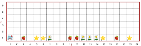
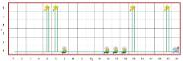

NAME:  

STUDENT ID:  

Remember to also initial in the upper right-hand header of each page.

**Due Fri Oct. 2nd at the end of class.**

# Portfolio 3: Conditionals


 To succeed in these problems you will need to read and engage with the embedded activities in the **Runestone texbook chapter(s)** (worth 0.5 of a grade percentage point):

* 5: Conditionals

Note that these activities are focused on this week's theme, but they are designed to utlize skills from all your previous portfolios as well. You should use your judgement to decide which tasks are best solved with which skills you have accumulated so far.


*For completing and self-correcting 70% of the below activities, you will earn 1 grade percentage point*. Additionally, for participating in a *share-out of 1 of the activities, you will earn 0.5 of a grade point*.

Note that some activities we will plan to start in class and others you need to start on your own. You should finish each activity before its in-class share-out in order to correct it before final submission. 

Remember to print and attach your programs for the coding activities. Programs should be submitted to gradescope for autograder results, but credit is giving to programs printed and included in this portfolio, on completetion, reguardless of autograder results. Programs should be marked up by hand for corrections.

## Table of Contents

This portfolio includes the following 10 activities and the report of your weekly share-out(s):

| Part   | Problem/Task                                 | Page | In-class Start | In-class Share-out  | Submission Format          | 
|----|------------------------------------------------ |------|---------|--------------|-----------------------------|
| A1  | Written prompt: if/then             |   2  |  F 9/25   |       |    written      |
| A2  | Python (conversions)              |  3   |   F 9/25  |   W 9/30    |    GS, print       |
| A3  |  Practical Practice                   |  5   |  M 9/28   |   M 9/28    |     GS, print      |
| A4  |  Python (painting)                   |   7  |  oyo   |  W 9/30      |      GS, print     |
| A5  |  Python (pay)                          |  9   |   W 9/30  |    W 9/30    |    GS, print       |
| A6  | Reeborg (walk through field)   |   11  |   F 10/2  |   F 10/2     |    GS, print       |
| A7  | Reeborg (more harvests)       |  13   |   oyo  |   F 10/2     |    GS, print       |
| A8  | Written prompt: multi-branch  |   15  |  oyo   |       |   written       |
| A9  | Written study questions            |   16  |  oyo   |   F 10/2     |    written      |
| A10 |  Reeborg (road repair)             |   18  |   oyo  |   F 10/2    |     GS, print      |
| B1  | Share-out report                      |  19   |  oyo  |       |    written      |
| B2  | Share-out report   (optional)      | 20    |    oyo |       |     written     |



# A1) Prompt: What is the difference between a function that prints something (or displays something, like drawing in Turtle) and a function that returns a value? Why might you want functions that return things? Frame your answer as an 'If/then' or 'if/then/otherwise' statement(s).





# A2) Conversions

Save all code for this problem in a file like `conversions.py`. Don’t forget to include comments for your code and to organize your code in a reasonable fashion.

1.	Write a function called `ft_to_in` that converts an integer indicating a measurement in feet to inches. Your function should only do the conversion if the input is a positive number.

* (1 ft = 12 in)

* Before writing any code, answer the following questions 

    +  How many parameters does this function need?
    + What does each parameter stand for?
    + What datatype should the parameter(s) be?
    + Does the function have a return value?
    	+ If so, what is the datatype of the return value?
    + Give 2-3 example function calls and the expected output of those calls.


    ………………………………………………………………………………………………

    ………………………………………………………………………………………………

    ………………………………………………………………………………………………

    ………………………………………………………………………………………………

    ………………………………………………………………………………………………

    ………………………………………………………………………………………………

    ………………………………………………………………………………………………

    ………………………………………………………………………………………………

2.	Write a function called `in_to_cm` that converts a measurement in inches to centimeters. Your function should only do the conversion if the input is less than 12 inches.

* (1 in ~= 2.54 cm)

* Think about your responses to the questions from 1. when writing this function.

3.	Write a function called `cm_to_m`  that converts a measurement in centimeters to meters.


* (1 m = 100 cm)

* Think about your responses to the questions from 1. when writing this function.

4.	Now write a function called `main` that:

    + Asks the user to input a height in feet and inches.
    + Uses the functions you defined in 1-3 to calculate the user’s height in meters.
    + At the end, the function should print out a message to let the user know what their height is in meters.

* Before writing any code, answer the following questions and include the answers as comments at the top of the file:

    + How many parameters does this function need, what do they stand for, and what datatype(s) should they be?
    + Does the function have a return value, and if so, what is its datatype?
    + Give an example function call and the expected output from the call.

* Recommendation: Have the user input the feet and inches portion of their height with two separate input calls.


    ………………………………………………………………………………………………

    ………………………………………………………………………………………………

    ………………………………………………………………………………………………

    ………………………………………………………………………………………………

    ………………………………………………………………………………………………

    ………………………………………………………………………………………………

    ………………………………………………………………………………………………

    ………………………………………………………………………………………………

    ………………………………………………………………………………………………


5. Did the version of your program you are submitting produce any errors (running in IDLE or autograder, if applicable)? How might you revise your algorithm and/or program?

    ………………………………………………………………………………………………

    ………………………………………………………………………………………………

    ………………………………………………………………………………………………

    ………………………………………………………………………………………………

    ………………………………………………………………………………………………

    ………………………………………………………………………………………………
6. Were you able to solve this task? If not, can you think of anything else to try?

    ………………………………………………………………………………………………

    ………………………………………………………………………………………………

    ………………………………………………………………………………………………

    ………………………………………………………………………………………………

    ………………………………………………………………………………………………

    ………………………………………………………………………………………………

    ………………………………………………………………………………………………

	**For portfolio submission, insert you printed program pages here.**






# A3) Prompt: Based on the "Practice Practical Exam" (handed out in class), what do you think you need to study/practice for the practical? What topics do you need to reiew? What questions do you have? Where could you find the answers?




# More space for study notes:


**For portfolio submission, insert you printed program pages after this page.**



# A4) Painting

A paint store wants to build a tool to help their customers estimate how much paint they need to buy and how much labor is going to cost if they hire the store’s painters to do the painting.

In your calculations, you can assume that all roms that need painting are rectangular. All walls of a room as well as its ceiling should be painted. You can disregard any windows and doors the room may or may not have. Write a program called `painting.py` that implements this tool.

1.	The paint store has determined that for every 121 square feet of wall space, one gallon of paint is needed. Write a function `paint_estimator` that, given the room’s dimensions (length, width, and height) in feet, returns how many gallons of paint are needed.

* What subtask do you have to solve for this problem? Define a separate function for it.

* In english (not code), what is your algorithm for your function/solution?

    ………………………………………………………………………………………………

    ………………………………………………………………………………………………

    ………………………………………………………………………………………………

    ………………………………………………………………………………………………

    ………………………………………………………………………………………………

    ………………………………………………………………………………………………

    ………………………………………………………………………………………………

    ………………………………………………………………………………………………

2.	The paint store has also determined that, for every 121 square feet of wall space, 8 hours of labor will be needed. The company charges $60 per hour of labor. Define another function called `labor_estimator` that, given the room’s dimensions (see previous), returns the labor cost.

* If you identified a good subtask in the first part of the problem, you should be able to re-use the function you defined for it.

* In english (not code), what is your algorithm for your function/solution?

    ………………………………………………………………………………………………

    ………………………………………………………………………………………………

    ………………………………………………………………………………………………

    ………………………………………………………………………………………………

    ………………………………………………………………………………………………

    ………………………………………………………………………………………………

    ………………………………………………………………………………………………

    ………………………………………………………………………………………………

3.	Now write a function called `main` that asks the user to input the dimensions of the room (length, width, and height) in feet. The function should then calculate how many gallons of paint are needed to paint the room and how much the labor will cost. It should print out a message to provide this information to the user.

* In english (not code), what is your algorithm for your function/solution?

    ………………………………………………………………………………………………

    ………………………………………………………………………………………………

    ………………………………………………………………………………………………

    ………………………………………………………………………………………………

    ………………………………………………………………………………………………

    ………………………………………………………………………………………………

    ………………………………………………………………………………………………

4.	(Optional) Change `main` to randomly generate the dimensions of the room instead of asking the user.

5. Did the version of your program you are submitting produce any errors (running in IDLE or autograder, if applicable)? How might you revise your algorithm and/or program?

    ………………………………………………………………………………………………

    ………………………………………………………………………………………………

    ………………………………………………………………………………………………

    ………………………………………………………………………………………………

    ………………………………………………………………………………………………

    ………………………………………………………………………………………………

    ………………………………………………………………………………………………

6. Were you able to solve this task? If not, can you think of anything else to try?

    ………………………………………………………………………………………………

    ………………………………………………………………………………………………

    ………………………………………………………………………………………………

    ………………………………………………………………………………………………

    ………………………………………………………………………………………………

    ………………………………………………………………………………………………

    ………………………………………………………………………………………………

    ………………………………………………………………………………………………

	**For portfolio submission, insert you printed program pages here.**





# A5) Overtime pay

1. Many companies pay time-and-a-half for any hours worked above 40 in a given week. Write a program named `overtime_pay.py` that includes a function called `calculate_wages` that takes two numbers indicating the hours worked (first parameter) and the hourly rate, then calculates the total wages for the week and returns them.

* In english (not code), what is your algorithm for your function/solution?

    ………………………………………………………………………………………………

    ………………………………………………………………………………………………

    ………………………………………………………………………………………………

    ………………………………………………………………………………………………

    ………………………………………………………………………………………………

    ………………………………………………………………………………………………

    ………………………………………………………………………………………………

    ………………………………………………………………………………………………

    ………………………………………………………………………………………………

2. Add some code to call the function. 

3. (Optional) Add input calls to ask the user for their hours worked and hourly wage.


* Were you able to use your function above without altering it? If you did alter it, in what way? Can you imagine doing it the other way?

    ………………………………………………………………………………………………

    ………………………………………………………………………………………………

    ………………………………………………………………………………………………

    ………………………………………………………………………………………………

    ………………………………………………………………………………………………

    ………………………………………………………………………………………………

    ………………………………………………………………………………………………

    ………………………………………………………………………………………………

    ………………………………………………………………………………………………


4. Did the version of your program you are submitting produce any errors (running in IDLE or autograder, if applicable)? How might you revise your algorithm and/or program?

    ………………………………………………………………………………………………

    ………………………………………………………………………………………………

    ………………………………………………………………………………………………

    ………………………………………………………………………………………………

    ………………………………………………………………………………………………

    ………………………………………………………………………………………………

    ………………………………………………………………………………………………

    ………………………………………………………………………………………………

5. Were you able to solve this task? If not, can you think of anything else to try?

    ………………………………………………………………………………………………

    ………………………………………………………………………………………………

    ………………………………………………………………………………………………

    ………………………………………………………………………………………………

    ………………………………………………………………………………………………

    ………………………………………………………………………………………………

    ………………………………………………………………………………………………

    ………………………………………………………………………………………………

    ………………………………………………………………………………………………

	**For portfolio submission, insert you printed program pages here.**



# A6) Walk Through Field

1.	Download the Walk Through Field folder (or its contents) from the course website, which should contain 2 json files, which each define a single world for Reeborg.
2.	Import both worlds into Reeborg and see what each world looks like.
3.	Reeborg’s goal is to walk along the bottom of the world and:
    a.	pick all strawberries
    b.	put any fallen stars back into the sky
    c.	perform a dance (turn 360 degrees) for each daisy

Below are before and after pictures for Field 0. 


::: {#fig-fields layout-ncol=2}

{ width=300px }

{ width=300px }

:::


4. In english (not code), what is your algorithm for your solution?

    ………………………………………………………………………………………………

    ………………………………………………………………………………………………

    ………………………………………………………………………………………………

    ………………………………………………………………………………………………

    ………………………………………………………………………………………………

    ………………………………………………………………………………………………

    ………………………………………………………………………………………………

    ………………………………………………………………………………………………

    ………………………………………………………………………………………………

    ………………………………………………………………………………………………

    ………………………………………………………………………………………………

    ………………………………………………………………………………………………


5.	Write a program that accomplishes these goals for both worlds called `walk_through_fields.py`.

Hint: the `object_here()` function can be given a string argument to check if a specific type of object is present (e.g. `object_here(“token”)`).


6. Did the version of your program you are submitting produce any errors (running in Reeborg or autograder, if applicable)? How might you revise your algorithm and/or program?

    ………………………………………………………………………………………………

    ………………………………………………………………………………………………

    ………………………………………………………………………………………………

    ………………………………………………………………………………………………

    ………………………………………………………………………………………………

    ………………………………………………………………………………………………

    ………………………………………………………………………………………………

    ………………………………………………………………………………………………

    ………………………………………………………………………………………………

7. Were you able to solve this task? If not, can you think of anything else to try?

    ………………………………………………………………………………………………

    ………………………………………………………………………………………………

    ………………………………………………………………………………………………

    ………………………………………………………………………………………………

    ………………………………………………………………………………………………

    ………………………………………………………………………………………………

    ………………………………………………………………………………………………

    ………………………………………………………………………………………………

    ………………………………………………………………………………………………

    ………………………………………………………………………………………………

	**For portfolio submission, insert you printed program pages here.**




# A7) Harvests


In Python, logical operators allow you to combine two conditions into a single, more complex condition. Python has three logical operators: and, or, and not.

`<condition> and <condition>` is `True` if both conditions are `True`.
`<condition> or <condition>` is `True` if at least one of the conditions is `True`.
`not <condition>` is `True` the condition is `False`.

1.	Download the Harvests folder from the course website and import each json file into Reeborg.
2.	Find `harvest1.py` from the folder and copy the code into Reeborg.
3.	Open the world Harvest 1 (from Reeborg’s “introduction” worlds).
4.	Run the code from `harvest1.py` and make sure you understand what it’s doing.
5.	Choose the world `harvest1a.json` (from the folder). You should notice that there are some holes in the field. Adapt the provided code so that Reeborg will harvest all of the carrots.

Hint: you should only have to change a small portion of the code for this and subsequent problems.

* In english (not code), what is your algorithm for your solution?

    ………………………………………………………………………………………………

    ………………………………………………………………………………………………

    ………………………………………………………………………………………………

    ………………………………………………………………………………………………

    ………………………………………………………………………………………………

    ………………………………………………………………………………………………

    ………………………………………………………………………………………………

    ………………………………………………………………………………………………

6.	In the world `harvest1b.json`.  Adapt the code so that Reeborg will plant carrots in the empty spots. Name this program `harvest1b.py`.

* What will you change about your algorithm for your solution?

    ………………………………………………………………………………………………

    ………………………………………………………………………………………………

    ………………………………………………………………………………………………

7.	In the world `harvest1c.json`, Reeborg is carrying an infinite supply of carrots. Adapt the code so that Reeborg plants carrots in the gaps in the field. Name this program `harvest1c.py`.

* What will you change about your algorithm for your solution?

    ………………………………………………………………………………………………

    ………………………………………………………………………………………………

    ………………………………………………………………………………………………

8.	In the world `harvest5.json`, Reeborg’s goal is to pick all of the flowers (daisies and tulips). Name this program `harvest5.py`.

* What will you change about your algorithm for your solution?

    ………………………………………………………………………………………………

    ………………………………………………………………………………………………

    ………………………………………………………………………………………………

9.	In the world `harvest7.json`, Reeborg should pick everything except for the smiley tokens (Reeborg knows these as “token”). Name this program `harvest7.py`.

* What will you change about your algorithm for your solution?

    ………………………………………………………………………………………………

    ………………………………………………………………………………………………

    ………………………………………………………………………………………………

10.	In the world `harvest8.json`, Reeborg should pick everything except the flowers (daisies and tulips). Name this program `harvest8.py`.

* What will you change about your algorithm for your solution?

    ………………………………………………………………………………………………

    ………………………………………………………………………………………………

    ………………………………………………………………………………………………


11. Did the versions of your programs you are submitting produce any errors (running in Reeborg or autograder, if applicable)? How might you revise your algorithms and/or programs?

    ………………………………………………………………………………………………

    ………………………………………………………………………………………………

    ………………………………………………………………………………………………

    ………………………………………………………………………………………………

    ………………………………………………………………………………………………

12. Were you able to solve these tasks? If not, can you think of anything else to try?

    ………………………………………………………………………………………………

    ………………………………………………………………………………………………

    ………………………………………………………………………………………………

    ………………………………………………………………………………………………

    ………………………………………………………………………………………………

**For portfolio submission, insert you printed program pages here.**



# A8) Prompt: What is a benefit of being able to use multi-branch conditionals over simple "if" or "if..else.." statements? Give an example of how using a multi-branch statement may make your code more DRY.




# A9) Check your understanding

1.	What is the value of `x` after this code runs?

```
x = 5
if x > 2:
	x = -3
	x = 1
else:
	x = 3
	x = 2
```

2.	What is the value of `x` after this code runs?

```
x = 1
if x > 2:
	x = -3
	x = 1
else:
	x = 3
	x = 2
```

3.	Given the function definition below, what will be printed to the screen when this code runs?

```
def is_odd(x):
	if x % 2 == 1:
	    return True
    else:
	    return False

print(is_odd(1))
print(is_odd(2))
print(is_odd(3.5))
print(is_odd("abc"))
```

4.	Consider the following function definition for is_odd. Can you rewrite the function so that it only uses one line after "def is_odd(x):"? If so, provide an example.

```
def is_odd(x):
    if x % 2 == 1:
        return True
    else:
        return False
```

5.	What gets printed when the following code runs?

```
grade = 100
if (grade >= 90):
    print("You got an A!")
if (grade >= 80):
    print("You got a B!")
else:
    print("You got another grade.")
```

6.	What gets printed when the following code runs?

```
grade = 100
if (grade >= 90):
	print("You got an A!")
elif (grade >= 80):
	print("You got a B!")
else:
	print("You got another grade.")
```


7.	Fill in the blanks in the code below so the following payscale is followed.


|            |            |     experience (years)   |               |               |
|------------|------------|---------------------------|---------------|---------------|
|            |            |     0                     |     1-2       |     3+        |
|     age    |     <18    |     $15.25                |     $16.00    |     $16.00    |
|            |     18+    |     $15.25                |     $16.25    |     $17.50    |


```
if experience == 0:
	wage = 15.25
elif (_1_):
	if (_2_):
		wage = 17.50
	else:
		wage = 16.25
else:
	wage = 16.0
```

8.	What will the value of y be after this code runs?

```
x = 8
y = (x > 4) and ((not(x>8))or(x==5))
```





# A10) Road Repair

Adjusting Reeborg’s speed: Reeborg’s speed can be adjusted using Reeborg’s think function, which takes a single parameter `ms`, which indicates how many milliseconds Reeborg should think before taking its next action. This means that the smaller numbers will make Reeborg go faster, while larger numbers will make it go slower. The default value is 250.

1.	Download the Road Repair files from the course website (3 json files for 3 Reeborg worlds) and import them into Reeborg. Each world should consist of a “roadway” with “potholes” in it.
Reminder: to import a world into Reeborg using a json file, follow these steps:
	a.	Click “Additional options” at the top right & Click the “Open world from file” button.
	b.	Select the json file you want to import.
2.	Write a program so Reeborg walks/drives along the road and fills in the potholes as it goes. Use Reeborg’s `build_wall` function, which puts a wall in front of Reeborg.
3.	You should write a single program that will solve all three roadX worlds in a program named `road_repair.py`.

* In english (not code), what is your algorithm for your solution?

    ………………………………………………………………………………………………

    ………………………………………………………………………………………………

    ………………………………………………………………………………………………

    ………………………………………………………………………………………………

    ………………………………………………………………………………………………

    ………………………………………………………………………………………………

    ………………………………………………………………………………………………


	6. Did the version of your program you are submitting produce any errors (running in Reeborg or autograder, if applicable)? How might you revise your algorithm and/or program?

    ………………………………………………………………………………………………

    ………………………………………………………………………………………………

    ………………………………………………………………………………………………

    ………………………………………………………………………………………………


7. Were you able to solve this task? If not, can you think of anything else to try?

    ………………………………………………………………………………………………

    ………………………………………………………………………………………………

    ………………………………………………………………………………………………

    ………………………………………………………………………………………………

**For portfolio submission, insert you printed program pages here.**





# B1: Share-out

0. Did you share-out this week? If not, and if you would like to make up your credit, where in the upcoming schedule would you like to be added?

    ………………………………………………………………………………………………

    ………………………………………………………………………………………………

    ………………………………………………………………………………………………

    ………………………………………………………………………………………………

1. For which activity did you share-out?

    ………………………………………………………………………………………………

    ………………………………………………………………………………………………

    ………………………………………………………………………………………………

    ………………………………………………………………………………………………

2. What was the solution you shared?

    ………………………………………………………………………………………………

    ………………………………………………………………………………………………

    ………………………………………………………………………………………………

    ………………………………………………………………………………………………

    ………………………………………………………………………………………………

    ………………………………………………………………………………………………

    ………………………………………………………………………………………………

3. If any, what changes did you make to your solution in response to questions or discussion?

    ………………………………………………………………………………………………

    ………………………………………………………………………………………………

    ………………………………………………………………………………………………

    ………………………………………………………………………………………………

    ………………………………………………………………………………………………

    ………………………………………………………………………………………………

    ………………………………………………………………………………………………

    

# B2: Share-out (optional)

0. Did you share-out this week? If not, and if you would like to make up your credit, where in the upcoming schedule would you like to be added?

    ………………………………………………………………………………………………

    ………………………………………………………………………………………………

    ………………………………………………………………………………………………

    ………………………………………………………………………………………………

1. For which activity did you share-out?

    ………………………………………………………………………………………………

    ………………………………………………………………………………………………

    ………………………………………………………………………………………………

    ………………………………………………………………………………………………

2. What was the solution you shared?

    ………………………………………………………………………………………………

    ………………………………………………………………………………………………

    ………………………………………………………………………………………………

    ………………………………………………………………………………………………

    ………………………………………………………………………………………………

    ………………………………………………………………………………………………

    ………………………………………………………………………………………………

3. If any, what changes did you make to your solution in response to questions or discussion?

    ………………………………………………………………………………………………

    ………………………………………………………………………………………………

    ………………………………………………………………………………………………

    ………………………………………………………………………………………………

    ………………………………………………………………………………………………

    ………………………………………………………………………………………………

    ………………………………………………………………………………………………

    


    