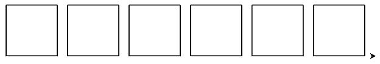
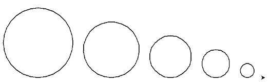
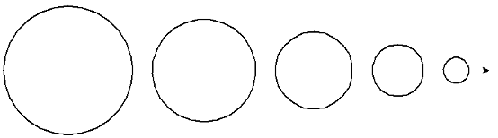
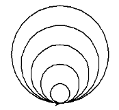
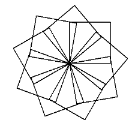
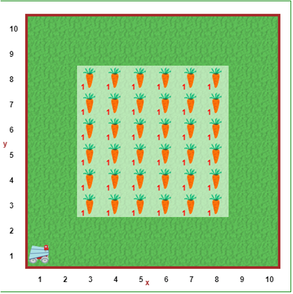
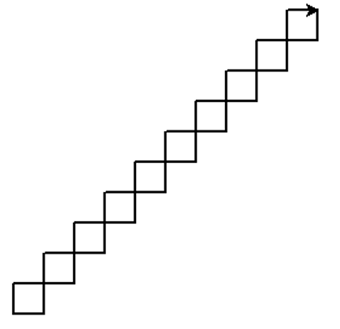

NAME: 

STUDENT ID:  

Remember to also initial in the upper right-hand header of each page.

**Due Friday Oct. 29th by the end of class.**


# Portfolio 7: Nested Data


 To succeed in these problems you will need to read and engage with the embedded activities in the **Runestone texbook chapter** (worth 0.5 of a grade percentage point):

* 10: Nested Data and Nested Iteration

Note that these activities are focused on this week's theme, but they are designed to utlize skills from all your previous portfolios as well. You should use your judgement to decide which tasks are best solved with which skills you have accumulated so far.

*For completing and self-correcting 70% of the below activities, you will earn 1 grade percentage point*. Additionally, for participating in a *share-out of 1 of the activities, you will earn 0.5 of a grade percentage point*.

Note that some activities we will plan to start in class and others you need to start on your own. You should finish each activity before its in-class share-out in order to correct it before final submission.

**Submission**: To get credit for completing a prgramming activity, submit it to gradescope and answer the written questions about your algorithm, whether your program worked and what troubleshooting you can think of. You *only have to print programs you want my feedback on*. Printed programs can still be marked up by hand for corrections.

## Table of Contents

This portfolio includes the following 10 activities and the report of your weekly share-out:

| Part   | Problem/Task                                 | Page | In-class Start | In-class Share-out  | Submission Format          | 
|----|------------------------------------------------ |----------|------------|--------------|-----------------------|
| A1  | Written prompt                                 |     |     |       |          |
| A6  |  Prog. with Pytthon (list micro)     |     |     |       |          |
| A6  |  Prog. with Pytthon (minimum)         |     |     |       |          |
| A2  |  Written (grid)                  |     |     |       |          |
| A3  |   Prog. with Pytthon (dict scenarios)                                           |     |     |       |          |
| A4  |                                                |     |     |       |          |
| A5  |                                                |     |     |       |          |
| A7  |                                                |     |     |       |          |
| A8  |                                       |     |     |       |          |
| A9  |  Written                                           |     |     |       |          |
| A10 |  Prog. with Pytthon (list sums)              |     |     |       |          |
| B1  | Share-out report                              |   21  | oyo |       |    written  |
| B2  | Share-out report   (optional)                 | 22    | oyo |       |     written     |




# A1) Prompt: What are some differences in the types of tasks that can be solved by indefinite vs definite iteration? Can you provide examples? Does one class of problems seem harder to solve than the other?





# A2) Tracing loops with Memory Diagrams

Consider the following snippet of Python code.
```
1.	x = int(input("Please enter a positive integer: "))
2.	counter = x
3.	for step in range(0,10):
4.	    print(counter)
5.	    counter += x
```
Note: `counter += 1` does the same thing as `counter = counter + 1`

1.	Draw a memory diagram after line 2 has been executed. What the user enters is up to you, but keep it in mind for the following questions.

\vspace{8em}

2.	Draw a memory diagram after line 5 has been executed the first time.

\vspace{8em}


3.	Draw a memory diagram after line 5 has been executed the second time.

\vspace{8em}

4.	Draw a memory diagram at the very end of the program.

\vspace{8em}





# A3) Debugging with Memory Diagrams

The following program is supposed to add up numbers entered by the user, but doesn’t work correctly.
```
1.	steps = int(input("How many numbers do you want to add up? "))
2.	total = 0
3.	number = float(input("Please enter the next number to add: "))
4.	for step in range(0, steps):
5.	    total = total + number  
6.	print("Total: ", total)
```

1.	Draw a memory diagram after line 2 has been executed. Assume that the user wants to add 4 numbers together.

\vspace{6em}

2.	Draw a memory diagram after line 5 has been executed the first time.

\vspace{6em}


3.	Draw a memory diagram after line 5 has been executed the second time.

\vspace{6em}

4.	Describe what the problem is with the program and how to fix it.

\vspace{8em}


5.	Copy the code into the code area of Python Tutor. 

6.	Click Visualize Execution and use the Next button to step through each line of code. The memory diagram will appear on the right. Check if your answers match.

7.	(Optional) Repeat steps 3 and 4 for the code on pages 2 and 3.





# A4) Circles & N-gons

1.	Write a program to draw the following pattern:


{ width=400px }

* Be sure to use the appropriate coding constructs.
* Note: the turtle doesn’t need to end where it does in the picture.
* Can you write a function that takes the number of squares to draw as a parameter?

* In english (not code), what is your algorithm for your function/solution?

    ………………………………………………………………………………………………

    ………………………………………………………………………………………………

    ………………………………………………………………………………………………

    ………………………………………………………………………………………………

    ………………………………………………………………………………………………

    ………………………………………………………………………………………………

2.	Write a program to draw a circle without using the built-in `turtle.circle()` function.

* In english (not code), what is your algorithm for your function/solution?

    ………………………………………………………………………………………………

    ………………………………………………………………………………………………

    ………………………………………………………………………………………………

    ………………………………………………………………………………………………

    ………………………………………………………………………………………………

    ………………………………………………………………………………………………


* Did the version of your program you are submitting produce any errors (running in IDLE or autograder, if applicable)? How might you revise your algorithm and/or program?

    ………………………………………………………………………………………………

    ………………………………………………………………………………………………

    ………………………………………………………………………………………………

    ………………………………………………………………………………………………

    ………………………………………………………………………………………………


* Were you able to solve this task? If not, can you think of anything else to try?

    ………………………………………………………………………………………………

    ………………………………………………………………………………………………

    ………………………………………………………………………………………………

    ………………………………………………………………………………………………

    ………………………………………………………………………………………………

    ………………………………………………………………………………………………


3. Circles with Turtle

a.	Write turtle code to create the following:

{ width=400px }

* In english (not code), what is your algorithm for your function/solution?

    ………………………………………………………………………………………………

    ………………………………………………………………………………………………

    ………………………………………………………………………………………………

    ………………………………………………………………………………………………

    ………………………………………………………………………………………………

    ………………………………………………………………………………………………


b.	Alter that modify your code so that it makes something like this (notice the circles are now lined up through their center points):

{ width=400px }

* In english (not code), what is your algorithm for your function/solution?

    ………………………………………………………………………………………………

    ………………………………………………………………………………………………

    ………………………………………………………………………………………………

    ………………………………………………………………………………………………

    ………………………………………………………………………………………………


c.	Modify the code again to make something like this:

{ width=200px }

* In english (not code), what is your algorithm for your function/solution?

    ………………………………………………………………………………………………

    ………………………………………………………………………………………………

    ………………………………………………………………………………………………

    ………………………………………………………………………………………………

    ………………………………………………………………………………………………

* Did the version of your program you are submitting produce any errors (running in IDLE or autograder, if applicable)? How might you revise your algorithm and/or program?

    ………………………………………………………………………………………………

    ………………………………………………………………………………………………

    ………………………………………………………………………………………………

    ………………………………………………………………………………………………


* Were you able to solve this task? If not, can you think of anything else to try?

    ………………………………………………………………………………………………

    ………………………………………………………………………………………………

    ………………………………………………………………………………………………

    ………………………………………………………………………………………………

    ………………………………………………………………………………………………


4. Regular n-gons with turtle: Write a program using turtle that does the following:

a.	Ask the user how many sides the shape should have
b.	Ask the user how long each side should be
c.	Uses turtle to draw a shape with the specified number of sides, each of the specified length


* In english (not code), what is your algorithm for your function/solution?

    ………………………………………………………………………………………………

    ………………………………………………………………………………………………

    ………………………………………………………………………………………………

    ………………………………………………………………………………………………

    ………………………………………………………………………………………………

    ………………………………………………………………………………………………


* Did the version of your program you are submitting produce any errors (running in IDLE or autograder, if applicable)? How might you revise your algorithm and/or program?

    ………………………………………………………………………………………………

    ………………………………………………………………………………………………

    ………………………………………………………………………………………………

    ………………………………………………………………………………………………

    ………………………………………………………………………………………………


* Were you able to solve this task? If not, can you think of anything else to try?

    ………………………………………………………………………………………………

    ………………………………………………………………………………………………

    ………………………………………………………………………………………………

    ………………………………………………………………………………………………

    ………………………………………………………………………………………………

    ………………………………………………………………………………………………


	**For feedback, insert you printed program(s) here.**





# A5) Math facts quiz

4. Write a function `math_quiz` that helps elementary students practice their math facts. 

-	Ask the user to input two numbers
-	Ask the user which number is greater
-	If the user’s answer is right, print : 

`“Correct!”`

-	If the user’s answer is wrong, print: 

`“Incorrect, the correct answer is <the correct value>!” `

5. In english (not code), what is your algorithm for your solution?

    ………………………………………………………………………………………………

    ………………………………………………………………………………………………

    ………………………………………………………………………………………………

    ………………………………………………………………………………………………

    ………………………………………………………………………………………………

    ………………………………………………………………………………………………

    ………………………………………………………………………………………………

6. (Optional) Add the functionality to randomly generate the two numbers instead of user input. Present the numbers to the user, and then wait for the user to input a result. 

* In english (not code), what is your algorithm for your solution?

    ………………………………………………………………………………………………

    ………………………………………………………………………………………………

    ………………………………………………………………………………………………

    ………………………………………………………………………………………………

    ………………………………………………………………………………………………

    ………………………………………………………………………………………………

    ………………………………………………………………………………………………

7. (Optional) If the user’s result is correct, the function should print out a message indicating as much. Otherwise, it should say that the answer was incorrect and show the right answer.

* In english (not code), what is your algorithm for your solution?

    ………………………………………………………………………………………………

    ………………………………………………………………………………………………

    ………………………………………………………………………………………………

    ………………………………………………………………………………………………

    ………………………………………………………………………………………………

    ………………………………………………………………………………………………

    ………………………………………………………………………………………………

**Give your programs meaningful names (ending in `.py`) and submit to Gradescope.**


8. Did the autograder(s) produce error messages? How might you revise your algorithm and/or program?

    ………………………………………………………………………………………………

    ………………………………………………………………………………………………

    ………………………………………………………………………………………………

    ………………………………………………………………………………………………

    ………………………………………………………………………………………………
9. Were you able to solve this task? If not, can you think of anything else to try?

    ………………………………………………………………………………………………

    ………………………………………………………………………………………………

    ………………………………………………………………………………………………

    ………………………………………………………………………………………………

    ………………………………………………………………………………………………

    ………………………………………………………………………………………………

**For feedback, insert you printed program(s) here.**




# A6) Written Turtle

1. Consider the following Python program:
    a. ```
        import turtle

        for size in range(10, 60):
            for side_count in range(0, 4):
                turtle.forward(size)
                turtle.left(90)
        ```

    b. Draw what shape the turtle draws when the inner loop is run once. Your sketch does not have to be to scale (any size is ok).

    \vspace{6em}

    c. Sketch what shape the turtle draws when the whole program is executed.

    \vspace{8em}


    d. Explain your answer to (b). How do the outer loop and the inner loop work together to produce the picture you sketched?

        ………………………………………………………………………………………………

        ………………………………………………………………………………………………

        ………………………………………………………………………………………………

        ………………………………………………………………………………………………

        ………………………………………………………………………………………………
        

2. How can we translate this code into a while loop?
```
1)	for i in range(n):
2)	     <body>
```

………………………………………………………………………………………………

………………………………………………………………………………………………

………………………………………………………………………………………………




# A7) Turtle Star

1. Write a program using the turtle module to draw the following picture. 

{ width=250px }

* Before writing any code, in english (not code), what is your algorithm for your solution?

    ………………………………………………………………………………………………

    ………………………………………………………………………………………………

    ………………………………………………………………………………………………

    ………………………………………………………………………………………………

    ………………………………………………………………………………………………

    ………………………………………………………………………………………………

* Did the version of your program you are submitting produce any errors (running in Reeborg or autograder, if applicable)? How might you revise your algorithm and/or program?

    ………………………………………………………………………………………………

    ………………………………………………………………………………………………

    ………………………………………………………………………………………………

    ………………………………………………………………………………………………


* Were you able to solve this task? If not, can you think of anything else to try?

    ………………………………………………………………………………………………

    ………………………………………………………………………………………………

    ………………………………………………………………………………………………

    ………………………………………………………………………………………………


	**For feedback, insert you printed program(s) here.**




# A8) Written Questions

### 1. Consider the following (incomplete) Python program:

```
x = int(input("Please input a positive integer: "))
counter = x
for step in range(0, 10):
```


Complete the missing lines of code above so that the program will produce the following output if the user inputs 3.

```
3
6
9
12
15
18
21
24
27
30
```

* **Notes**: You do not need to introduce any additional variables. There is more than one way to achieve this result.


### 2. Consider the following (incomplete) Python program to list the first few Fibonacci numbers:

The Fibonacci numbers are the following sequence of numbers:


0, 1, 1, 2, 3, 5, 8, 13, 21, 34, 55, …


* The first two numbers are 0 and 1. 

* After that, each number can be calculated by adding the previous two together. For example: 
    + the third number is 1 (0+1)
    + the fourth number is 2 (1+1)
    + the fifth number is 3 (2+1), etc.

They are named Fibonacci numbers after the Italian mathematician who first described them in Europe. Patterns based on the Fibonacci sequence show up in surprisingly many contexts in math, biology, and art.
(See the Wikipedia entry if you want to know more.)

Below is the (incomplete) Python program to list the first few Fibonacci numbers. 

The user gets to determine how many Fibonacci numbers to list.

```
1.	print (“How many Fibonacci numbers would you like to see?”)
2.	limit = int (input(“Please input a number greater than 2: ”))
3.	
4.	fib_0 = 0
5.	fib_1 = 1
6.	
7.	print(fib_0)
8.	print(fib_1)
9.	for count in range(        ):
10.	   next_fib = 
11.	   print(next_fib)
```

* For questions a-d, assume that the program has been completed and functions correctly.

2.a. Draw a memory diagram that shows the<variable name>-<value/object> associations after line 5 has been executed. Assume that the user inputted 10. Also show what will have been printed to the screen at that point.

\vspace{6em}


2.b. Draw a memory diagram that shows the <variable name>-<value/object> associations that should exist after line 11 has been executed for the first time. Also show what line 11 will print to the screen when it is executed for the first time.

\vspace{6em}


2.c. What should the <variable name>-<value/object> associations be when line 11 has been executed for the second time? Draw a memory diagram.

\vspace{6em}


2.d. Draw a memory diagram that shows the <variable name>-<value/object> associations after the last number has been printed (i.e. at the end of the program).

\vspace{6em}

2.e. Complete the code above so that the program prints the first n Fibonacci numbers, where n is determined by the user. You may need to add new lines of code.


### 3. Consider two Python programs:

* Both programs on the next page will help Reeborg harvest the carrots in the Harvest 1 world:

::: {layout-ncol=2}
```
# Program 1

1  def turn_right():
2 	turn_left()
3 	turn_left()
4 	turn_left()
5 
6  def a():
7 	move()
8	turn_left()
9	move()
10	move()
11	turn_right()
12	move()
13
14 def b():
15	for carrot in range(0, 6):
16		take()
17		move()
18
19 def c():
20	turn_left()
21	move()
22	turn_left()
23	move()
24
25 def d():
26	turn_right()
27	move()
28	turn_right()
29	move()
30
31 a()
32 for double_row in range(0, 3):
33	b()
34	c()
35	b()
36	d()
```

```
# Program 2

1  def turn_right():
2	turn_left()
3	turn_left()
4	turn_left()
5
6  def e():
7	move()
8	turn_left()
9	move()
10	move()
11	turn_right()
12	move()
13	take()
14
15 def f():
16	for carrot in range(0, 5):
17		move()
18		take()
19
20 def g():
21	f()
22	turn_left()
23	move()
24	turn_left()
25	take()
26
27 def h():
28	f()
29	turn_right()
30	move()
31	turn_right()
32	take()
33
34 e()
35 for double_row in range(0, 2):
36	g()
37	h()
38 g()
39 f() 
```

:::


{ width=275px }


* Both programs define a number of functions. Unfortunately, the program designers were from the bad old days when names needed to be as short as possible, so their function names are essentially meaningless. Come up with better names for each of the functions that they defined.

a.	………………………………………………………………………………………………
b.	………………………………………………………………………………………………
c.	………………………………………………………………………………………………
d.	………………………………………………………………………………………………
e.	………………………………………………………………………………………………
f.	………………………………………………………………………………………………
g.	………………………………………………………………………………………………
h.	………………………………………………………………………………………………


3.i **After** you’ve come up with better names for the functions, which of the solutions do you think is better and why?


………………………………………………………………………………………………

………………………………………………………………………………………………

………………………………………………………………………………………………

………………………………………………………………………………………………

………………………………………………………………………………………………

………………………………………………………………………………………………

………………………………………………………………………………………………




# A9) Turtle Stairs

1.	Create a file called square_chain.py for your code.
2.	Write a Python program using turtle to draw something that draws a diagonal chain of 10 squares:


{ width=250px }

There are many different ways (algorithms) that you can draw this pattern. Some may (or may not) leave the turtle in the same position and orientation that you see here. It does not matter if the turtle has the same position and orientation as what you see here.

3.	Add comments to explain how your program works.
    + Header comment with Name, Email, Date, Assignment, Description
    + In-line comments describing the algorithm guiding your program
    + Docstrings for any functions, if you define new functions

* In english (not code), what is your algorithm for your solution?

    ………………………………………………………………………………………………

    ………………………………………………………………………………………………

    ………………………………………………………………………………………………

    ………………………………………………………………………………………………

    ………………………………………………………………………………………………

    ………………………………………………………………………………………………

    ………………………………………………………………………………………………

    ………………………………………………………………………………………………

    ………………………………………………………………………………………………

    ………………………………………………………………………………………………

    ………………………………………………………………………………………………

    ………………………………………………………………………………………………
* Did the version of your program you are submitting produce any errors (running in Reeborg or autograder, if applicable)? How might you revise your algorithm and/or program?

    ………………………………………………………………………………………………

    ………………………………………………………………………………………………

    ………………………………………………………………………………………………

    ………………………………………………………………………………………………

    ………………………………………………………………………………………………

    ………………………………………………………………………………………………

    ………………………………………………………………………………………………

    ………………………………………………………………………………………………

    ………………………………………………………………………………………………

* Were you able to solve this task? If not, can you think of anything else to try?

    ………………………………………………………………………………………………

    ………………………………………………………………………………………………

    ………………………………………………………………………………………………

    ………………………………………………………………………………………………

    ………………………………………………………………………………………………

    ………………………………………………………………………………………………

    ………………………………………………………………………………………………

    ………………………………………………………………………………………………

	**For feedback, insert you printed program(s) here.**




# A10)  Retirement Calculator

It’s never too early to start saving for retirement. For this assignment you’re going to write a simple retirement calculator.


* A run of the program may look like the following (user input in bold):

```
How much do you plan to save each month? (in dollars) **100**
How old are you? (in years) **20**
At what age do you plan to retire? (in years) **40**
What yearly rate of return do you expect? (in percentage points) **5**
Your savings at age 21 are: $ 1200
Your savings at age 22 are: $ 2460
Your savings at age 23 are: $ 3783
Your savings at age 24 are: $ 5172
Your savings at age 25 are: $ 6630
Your savings at age 26 are: $ 8162
Your savings at age 27 are: $ 9770
Your savings at age 28 are: $ 11458
Your savings at age 29 are: $ 13231
Your savings at age 30 are: $ 15093
Your savings at age 31 are: $ 17048
Your savings at age 32 are: $ 19100
Your savings at age 33 are: $ 21255
Your savings at age 34 are: $ 23518
Your savings at age 35 are: $ 25894
Your savings at age 36 are: $ 28388
Your savings at age 37 are: $ 31008
Your savings at age 38 are: $ 33758
Your savings at age 39 are: $ 36646
Your savings at age 40 are: $ 39679
```


1. Start by creating a file called retirement.py for your code.

2. Next, start writing code to get input from the user and store the information in variables.

* The program should start by asking the user for the following information:
    + The amount they plan to save each month
    + Their starting age
    + Their planned retirement age
    + The yearly rate of return they expect (i.e. growth through interest or dividends).

3. Now design an algorithm to compute the amount that accumulates each year. Write out the algorithm in a human language (e.g. English) before writing it in code. Include this as your description in your header comment.

* The program should show how the user’s savings grow over the course of their careers. For example, if a 20 year-old starts saving $100 a month, retires at 40, and gets a 5% rate or return, then they should have about $39,679 by the time they retire.

* To simplify things, we assume that interest is added once per year before the user has contributed any of their monthly savings.  
    + This means that, for the first year, the rate of return is zero, so they only get what they saved over the course of the year (i.e. $1200). 
    + For subsequent years, calculate the interest gained, then add the yearly contribution. So for year 2:
        * the interest will be $1200 × 5% = $60
        * the savings at the end of year will be $1200 + $60 + $1200= $2460.

4. Implement the program in Python
5. Test the program with different values to ensure that it works correctly.
6. If you haven’t already, add comments explaining how the program works.

* In english (not code), what is your algorithm for your solution?

    ………………………………………………………………………………………………

    ………………………………………………………………………………………………

    ………………………………………………………………………………………………

    ………………………………………………………………………………………………

    ………………………………………………………………………………………………

    ………………………………………………………………………………………………

    ………………………………………………………………………………………………


    * Did the version of your program you are submitting produce any errors (running in Reeborg or autograder, if applicable)? How might you revise your algorithm and/or program?

    ………………………………………………………………………………………………

    ………………………………………………………………………………………………

    ………………………………………………………………………………………………

    ………………………………………………………………………………………………

    ………………………………………………………………………………………………

* Were you able to solve this task? If not, can you think of anything else to try?

    ………………………………………………………………………………………………

    ………………………………………………………………………………………………

    ………………………………………………………………………………………………

    ………………………………………………………………………………………………

    ………………………………………………………………………………………………

    ………………………………………………………………………………………………


	**For feedback, insert you printed program(s) here.**



# B1: Share-out

0. Did you share-out this week? If not, and if you would like to make up your credit, where in the upcoming schedule would you like to be added?

    ………………………………………………………………………………………………

    ………………………………………………………………………………………………

    ………………………………………………………………………………………………

    ………………………………………………………………………………………………

1. For which activity did you share-out?

    ………………………………………………………………………………………………

    ………………………………………………………………………………………………

    ………………………………………………………………………………………………

    ………………………………………………………………………………………………

2. What was the solution you shared?

    ………………………………………………………………………………………………

    ………………………………………………………………………………………………

    ………………………………………………………………………………………………

    ………………………………………………………………………………………………

    ………………………………………………………………………………………………

    ………………………………………………………………………………………………

    ………………………………………………………………………………………………

3. If any, what changes did you make to your solution in response to questions or discussion?

    ………………………………………………………………………………………………

    ………………………………………………………………………………………………

    ………………………………………………………………………………………………

    ………………………………………………………………………………………………

    ………………………………………………………………………………………………

    ………………………………………………………………………………………………

    ………………………………………………………………………………………………

    

# B2: Share-out (optional)

0. Did you share-out this week? If not, and if you would like to make up your credit, where in the upcoming schedule would you like to be added?

    ………………………………………………………………………………………………

    ………………………………………………………………………………………………

    ………………………………………………………………………………………………

    ………………………………………………………………………………………………

1. For which activity did you share-out?

    ………………………………………………………………………………………………

    ………………………………………………………………………………………………

    ………………………………………………………………………………………………

    ………………………………………………………………………………………………

2. What was the solution you shared?

    ………………………………………………………………………………………………

    ………………………………………………………………………………………………

    ………………………………………………………………………………………………

    ………………………………………………………………………………………………

    ………………………………………………………………………………………………

    ………………………………………………………………………………………………

    ………………………………………………………………………………………………

3. If any, what changes did you make to your solution in response to questions or discussion?

    ………………………………………………………………………………………………

    ………………………………………………………………………………………………

    ………………………………………………………………………………………………

    ………………………………………………………………………………………………

    ………………………………………………………………………………………………

    ………………………………………………………………………………………………

    ………………………………………………………………………………………………

    

